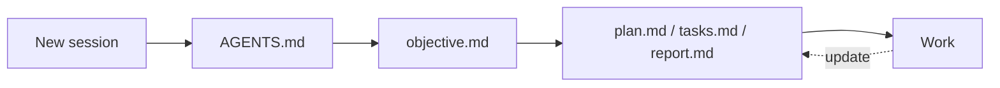

# Create a Workplan



## Location

- `workplans/<topic>/` at the workspace root, or the repository root for a standalone project. `<topic>` is lower-case kebab-case, the words the user uses for the task.
- Create both `workplans/<topic>/worktrees/` and `workplans/<topic>/artifacts/` when setting up the workplan.
- The folder is local and temporary. Keep it out of git:

  ```bash
  git check-ignore -q workplans || echo 'workplans/' >> "$(git rev-parse --git-path info/exclude)"
  ```

## Documents

| File | Content | Update when |
|---|---|---|
| `objective.md` | Goal, scope, constraints, workspace paths, guidelines, verification, what the report should answer | The user changes the goal or adds guidance |
| `plan.md` | Approach, phases, dependencies, key decisions and reasons | A planning decision changes |
| `tasks.md` | Concrete tasks in order, links to the plan, status | A task starts, finishes, or changes |
| `report.md` | Results and history: findings, attempts, analysis, conclusions, verification | Something relevant is learned |

Templates are in `templates/`. Keep their purpose statements and the `Goal`, `Verification`, and `Guidelines` sections in `objective.md`; choose other sections and detail to fit the task.

`Guidelines` holds the template defaults and guidance the user gives for this task. Do not copy rules that already apply from `CLAUDE.md`, `AGENTS.md`, or skills.

## Workflow

For an existing workplan, start with `objective.md`. For a new or incomplete workplan, begin with Discuss.

### Discuss

A request for a plan starts discussion. Do not create workplan documents until the user explicitly agrees to enter Create.

1. Explore the code, data, and existing checks; clarify the goal, scope, constraints, and success criteria, and challenge assumptions.
2. Compare viable architectures, including simpler approaches, for benefits, drawbacks, uncertainties, and adaptability to likely changes.
3. Compare verification methods against success criteria: coverage, blind spots, costs, and independently justified expected results.
4. Recommend options with reasons, evidence that could change your view, and small tests or prototypes to check uncertain assumptions.
5. Ask focused questions about consequential tradeoffs; wait for the user's answers and refine the proposals together, keeping unresolved decisions visible.
6. Once consequential questions are resolved or explicitly deferred, ask whether the user is ready to create the plan and wait for agreement.

### Create

1. Create the workplan from the templates using the structure above, and draft `objective.md`. Resolve template skill links relative to the generated documents.
2. Record agreed verification in `objective.md` and the approach, alternatives, and decision reasons in `plan.md`; revise until the user approves both.
3. Break the approved plan into `tasks.md`, linking plan sections and recording dependencies and status.
4. Ensure the applicable `AGENTS.md` directs each new or resumed session to the matching `workplans/<topic>/objective.md`; reuse an existing rule when present.
5. Start execution following `objective.md`.
